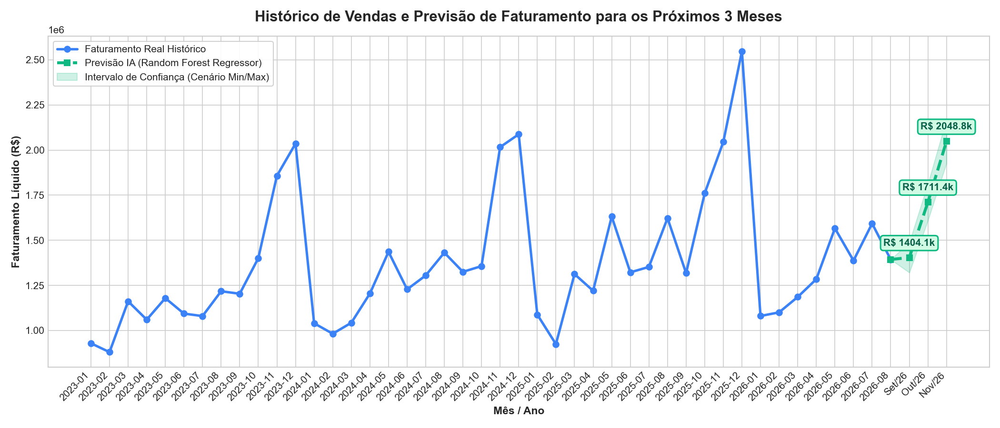
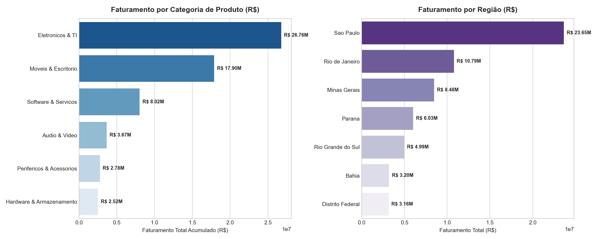

# 📊 Previsão de Faturamento & Análise de Vendas com Machine Learning

<p align="center">
  
  
  
  
</p>

---

## 🎯 Visão Geral do Projeto
Este projeto implementa um pipeline completo de **Ciência de Dados e Machine Learning** para análise transacional de vendas e **previsão de faturamento trimestral**.

O objetivo de negócio é responder com precisão à pergunta estratégica:  
> **"Quanto a empresa provavelmente irá faturar nos próximos 3 meses?"**

---

## 🚀 Resultados da Previsão de Faturamento (Próximos 3 Meses)

O modelo preditivo campeão (**Random Forest Regressor**) obteve um **MAPE de 5,93%** (precisão média de **94,07%**):

| Mês / Período | Previsão Estimada (R$) | Cenário Pessimista (-95% CI) | Cenário Otimista (+95% CI) | Contexto Comercial |
| :--- | :---: | :---: | :---: | :--- |
| **Setembro/2026** | **R$ 1.404.146,30** | R$ 1.320.903,06 | R$ 1.487.389,54 | Estabilidade pós-inverno |
| **Outubro/2026** | **R$ 1.711.389,96** | R$ 1.609.932,13 | R$ 1.812.847,80 | Aquecimento Q4 / Varejo |
| **Novembro/2026** | **R$ 2.048.794,16** | R$ 1.927.333,69 | R$ 2.170.254,62 | 🔥 **Pico Black Friday** |
| **TOTAL TRIMESTRE** | **R$ 5.164.330,42** | **R$ 4.858.168,88** | **R$ 5.470.491,96** | **Faturamento > R$ 5,16M** |

---

## 📈 Gráfico de Série Temporal & Forecast


---

## 🛠️ Arquitetura e Estrutura dos Dados
- **Total de Vendas Analisadas:** 29.094 pedidos
- **Total de Itens Vendidos:** 52.083 unidades
- **Faturamento Histórico Acumulado:** R$ 60.290.802,09
- **Lucro Líquido Acumulado:** R$ 25.012.437,09 (Margem Líquida de 41,5%)
- **Ticket Médio:** R$ 2.072,28

### Distribuição por Categoria & Região


---

## 🤖 Comparação de Modelos de Machine Learning
Foram desenvolvidos e avaliados 4 algoritmos preditivos sob validação cruzada temporal (*TimeSeriesSplit / Holdout*):

1. **Random Forest Regressor (Campeão):** MAPE 5,93% | MAE: R$ 84.102,86
2. **Regressão Linear Múltipla:** MAPE 11,52% | MAE: R$ 161.334,86
3. **Ridge Regression (L2):** MAPE 11,61% | MAE: R$ 161.264,61
4. **Gradient Boosting Regressor:** MAPE 15,23% | MAE: R$ 211.381,00

---

## 📁 Estrutura de Arquivos no Repositório
```text
├── gerar_banco_dados.py              # Script gerador do banco relacional SQLite e dados sintéticos
├── analise_e_machine_learning.py      # Pipeline de EDA, Feature Engineering e Modelos de ML
├── dashboard_vendas.html             # Dashboard interativo com KPIs e gráficos Chart.js
├── dump_banco_nuvem_supabase_mysql.sql # Dump SQL pronto para Supabase (PostgreSQL) e phpMyAdmin (MySQL)
├── vendas_historico_completo.csv     # Base de dados estruturada em CSV
├── resultado_previsao.json           # Métricas e dados calculados em JSON
├── grafico_previsao_faturamento.png  # Gráfico da previsão e intervalo de confiança
├── grafico_eda_categorias.png        # Gráfico da análise exploratória
└── README.md                         # Documentação completa do projeto
```

---

## 💻 Como Executar o Projeto Localmente

1. **Clonar o Repositório:**
   ```bash
   git clone https://github.com/jhonnybsilva/previsao-faturamento-machine-learning.git
   cd previsao-faturamento-machine-learning
   ```

2. **Instalar Dependências:**
   ```bash
   pip install pandas numpy scikit-learn matplotlib seaborn
   ```

3. **Gerar Base de Dados & Executar Machine Learning:**
   ```bash
   python gerar_banco_dados.py
   python analise_e_machine_learning.py
   ```

---

## 👤 Autor
**Jhonny Brasiliano da Silva**  
- LinkedIn: [linkedin.com/in/jhonnybrasilianodasilva](https://www.linkedin.com/in/jhonnybrasilianodasilva)  
- GitHub: [github.com/jhonnybsilva](https://github.com/jhonnybsilva)  
- E-mail: jhonnybrasilianodasilva123etec@gmail.com
